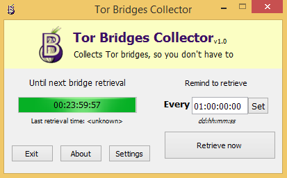

## Tor Bridges Collector



Collects Tor bridges, so you don't have to.

Tor Bridges Collector helps you frequently update your Tor bridges list.
It also has options for modifying your torrc with new bridges on each retrieval, and storing all previously retrieved bridges in a file.

# Install

### From releases

[Download precompiled binaries](https://github.com/izmukx/TorBridgesCollector/releases)


### Building from sources


**On Linux**

Clone Tor Bridges Collector's repository

```
git clone https://github.com/izmukx/TorBridgesCollector.git
```

Run qmake

```
qmake TorBridgesCollector.pro -spec linux-g++
```

Run make

```
make
```

Open the binary

```
./TorBridgesCollector
```

**On Windows**

The easiest way probably would be to download [Qt Creator](https://download.qt.io), import the project and build it there.


## LICENSE
Tor Bridges Collector is being distributed under [GNU LGPL version 3 License](https://github.com/izmukx/TorBridgesCollector/blob/master/LICENSE)

## NOTICE
This product is produced independently from the Tor® anonymity software and carries no guarantee from The Tor Project about quality, suitability or anything else.

Created by [izmukx](https://izmukx.github.io)
